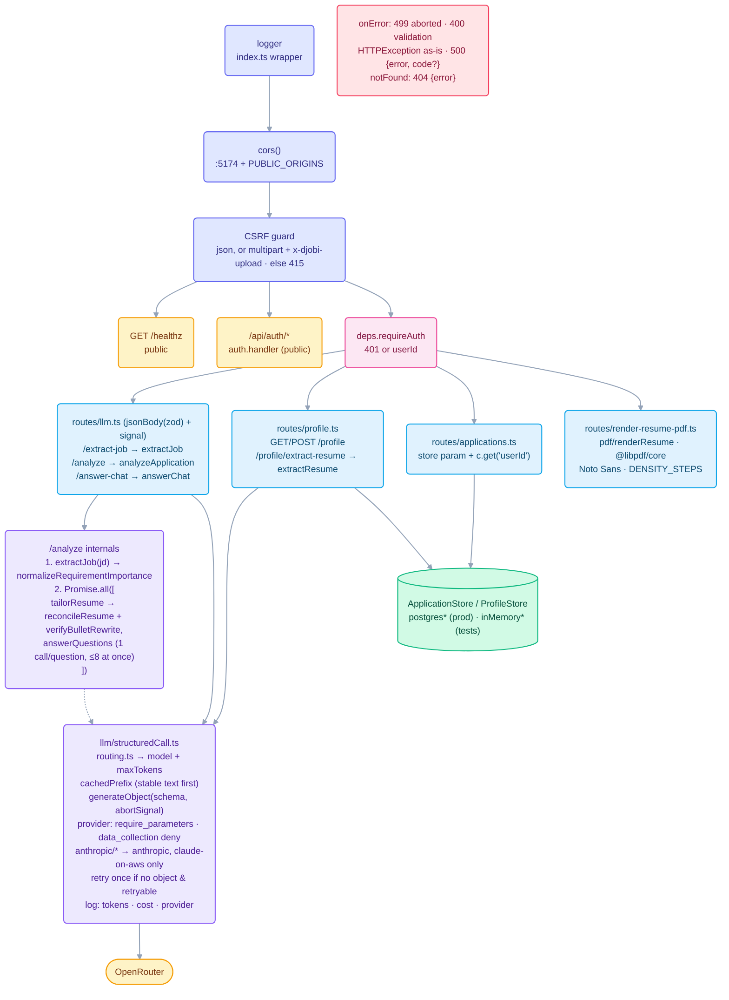
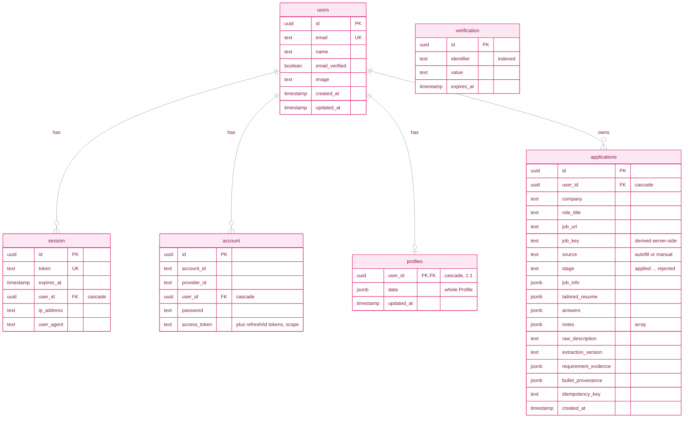

# backend

The Hono server behind djobi: extracts Job Info from a Job Description, tailors resumes, drafts and
refines application answers, extracts a draft Profile from a resume PDF, renders the resume PDF,
authenticates both clients (Better Auth), and persists users, Profiles and Applications. Runs on
`127.0.0.1:5391`. Needs an OpenRouter key and any Postgres (local, Docker or cloud — see
`docs/adr/0002-postgres-driver-for-local-dev.md`); Google is optional, for Google sign-in. Auth design:
`docs/multi-tenant-auth.md`. Domain terms: root `CONTEXT.md`.

## Backend request path

`index.ts` mounts `createApp(deps)` under a logger and binds it to `$HOST` (default `127.0.0.1`) on
`$PORT` (default 5391). `app.ts` registers middleware in a fixed order. Because Hono runs handlers in
registration order, that order is what makes the guards work.

No route handler has its own `try/catch`. Validation errors become 400, including an oversized
resume upload (its body limit throws `RequestValidationError`). A client that disconnects gets 499
(empty body, not logged), and bad model output becomes 500 with `code: invalid-model-output`. An
unknown path is a 404. All of these except the 499 return the `{error}` shape that
`@djobi/http-client` parses. Two things fall outside that shape: `/api/auth/*` returns Better Auth's
own responses, and a Hono `HTTPException` (none is thrown by this app today) is returned as built.

### Route surface

| Route                                                                    | Kind | Model / store                                       | Called by                                                          |
| ------------------------------------------------------------------------ | ---- | --------------------------------------------------- | ------------------------------------------------------------------ |
| `POST /analyze`                                                          | LLM  | flash-lite, then sonnet-5 ×2 in parallel            | extension Analysis Step                                            |
| `POST /extract-job`                                                      | LLM  | gemini-3.1-flash-lite · 4096 tok                    | extension Log tab, dashboard New Application                       |
| `POST /answer-chat`                                                      | LLM  | claude-sonnet-5 · 4096 tok                          | extension Ask tab                                                  |
| `POST /profile/extract-resume`                                           | LLM  | unpdf → flash-lite · 4096 tok · 5 MB cap            | extension options page, dashboard Profile                          |
| `GET`/`POST /profile`                                                    | DB   | profiles upsert on `user_id`                        | extension panel, options, Save Step; dashboard                     |
| `GET /applications`                                                      | DB   | `list`                                              | dashboard                                                          |
| `GET /applications?jobUrl=…&response=compact`                            | DB   | `duplicateSummary` by `job_key` (+ exact `job_url`) | Duplicate Guard: Analysis Step, Log tab, dashboard New Application |
| `GET /applications/:id`                                                  | DB   | `byId`                                              | no current client                                                  |
| `POST /applications` (+ `idempotency-key`)                               | DB   | `ON CONFLICT (user_id, idempotency_key)`            | Save Step, Log tab, dashboard New Application                      |
| `PATCH /applications/:id`                                                | DB   | `replaceSnapshot` (keeps stage, notes, source)      | Save Step re-save                                                  |
| `PATCH /applications/:id/stage`                                          | DB   | `setStage`                                          | dashboard                                                          |
| `POST /applications/:id/notes`, `DELETE /applications/:id/notes/:noteId` | DB   | `appendNote` / `deleteNote`                         | dashboard                                                          |
| `DELETE /applications/:id`                                               | DB   | `deleteApplication`                                 | dashboard                                                          |
| `POST /render-resume-pdf`                                                | PDF  | `@libpdf/core`                                      | Fill Step, panel resume preview                                    |
| `GET /healthz`                                                           | —    | `{ ok: true }`                                      | Docker Compose healthcheck                                         |
| `* /api/auth/*`                                                          | auth | Better Auth                                         | dashboard and extension sign-in/up/out                             |

## Data model

`db/schema.ts` · Drizzle migrations `0000`–`0012`

- **`users`** is Better Auth's user table (`modelName: 'users'`). `session`, `account` and
  `verification` are Better Auth's own. Every `user_id` foreign key cascades on delete.
- **`applications` indexes:** `(user_id, job_url, created_at DESC)`,
  `(user_id, job_key, created_at DESC)`, `(user_id, created_at DESC)`, and unique
  `(user_id, idempotency_key)`.
- **`stage`:** `applied` → `rejected_ats` → `phone_screen` → `onsite` → `offer` → `rejected`.

Applications store _snapshots_ as jsonb, so an old row still reads correctly after prompts or schemas
change. `PATCH /applications/:id` can never overwrite `stage`, `notes` or `source`: tracking data and
provenance live outside the editable snapshot. Notes are added with `POST …/notes` and removed one at
a time with `DELETE …/notes/:noteId`.

## `src/app.ts` / `src/index.ts`

`app.ts` exports `createApp(deps)`, which takes the stores and `requireAuth` as dependencies so tests
drive it with `app.request(...)` over in-memory stores (`testApp.ts`) — no port, no database, no
`.env`. Middleware order matters because Hono runs handlers in registration order:

1. **CORS** for the dashboard: an explicit origin list (`:5174` plus `PUBLIC_ORIGINS`), never `*` —
   the server holds an OpenRouter key and any page can reach `127.0.0.1`.
2. **CSRF guard**: every `POST`/`PATCH`/`PUT`/`DELETE` must be `application/json` (or multipart with
   the non-simple `x-djobi-upload` header), else **415**. CORS alone only blocks cross-origin
   _reads_; forcing a preflight is what blocks cross-origin _writes_.
3. `GET /healthz` and `/api/auth/*` (Better Auth), both public.
4. **`requireAuth`**: accepts the dashboard's `httpOnly` cookie or the extension's bearer token and
   sets `c.get('userId')`; everything after it — including LLM routes — needs a session.

`onError` is the one place a throw becomes a response (see the table above). `index.ts` loads `.env`,
wraps `app` in a logging `Hono` instance (a logger added after the routes would never run), and
binds `$HOST` (default `127.0.0.1`; Docker Compose sets `0.0.0.0`) on `$PORT` (default 5391).

## Debugging

`pnpm dev:backend` logs one line per request (`--> POST /analyze 200 5123ms`), and `app.onError` logs
every uncaught failure with method, path and stack. The extension's Analysis Step is a single
`POST /analyze`; the Log tab and dashboard call `/extract-job` alone. A 500 from `/analyze` is
usually a missing `OPENROUTER_API_KEY`.

To step through code, start with an inspector: `pnpm dev:backend:debug` (`tsx watch --inspect`), or
`pnpm --filter backend exec tsx --inspect src/index.ts` to avoid watch-mode restarts dropping the
debugger. Then attach from `chrome://inspect`, `node inspect 127.0.0.1:9229`, or an editor (e.g.
`nvim-dap` with `js-debug-adapter`, `request = "attach"`, port 9229, `sourceMaps = true`). Don't
exclude `node_modules` from source maps: `@djobi/shared` is reached through a workspace symlink.

Usually faster: reproduce the bug as a route test with `app.request('/analyze', { method: 'POST',
headers: { 'content-type': 'application/json' }, body })`.

## `src/routes/`

Bodies are validated by `jsonBody`/`queryParams`/`pathParams` (`requestBody.ts`) against the shared
`@djobi/shared` `wire.ts` schemas, so the backend and its clients use one contract. Route tests
always send `content-type: application/json` (the CSRF guard answers anything else first).

- **`llm.ts`** — `/extract-job`, `/analyze`, `/answer-chat`:
  one-line registrations that pass the request's `AbortSignal` down, so a disconnected client stops
  billed generation.
- **`profile.ts`** — `GET`/`POST /profile`, and `POST /profile/extract-resume` (multipart field
  `resume`, 5 MB cap), which returns a draft and never saves.
- **`applications.ts`** — the Application resource. `response=compact` returns small
  acknowledgements (`{ id }`, `{ id, stage }`, `{ id, note }`, or the Duplicate Guard summary for
  `?jobUrl=`); without it, the full row (from the write's own `RETURNING`). `POST` honours an
  optional `idempotency-key` header. `PATCH /applications/:id` takes an `ApplicationSnapshot`, which
  excludes `source`, `stage` and `notes`, so stage and notes have their own routes.
- **`render-resume-pdf.ts`** — raw `application/pdf` bytes (the extension uses the transport's
  `binary()`), no cache. The Fill Step starts the render early, alongside its page scan.

## `src/db/`

- **`schema.ts`** — the tables in the diagram above. `profiles` is keyed by `user_id` (one Profile per
  user; saves are one upsert). `applications.job_key` is derived server-side by `jobKeyForUrl` and
  is `NULL` on older rows, which the Duplicate Guard matches by exact `job_url` instead.
- **`client.ts`** — lazy Drizzle client over a `pg` pool: nothing reads `DATABASE_URL` until the
  first query, which throws a clear error if it's unset.
- **`applicationStore.ts` / `profileStore.ts`** — the store interfaces plus in-memory adapters for
  tests (never wired into `index.ts`). `postgres*Store.ts` are the real adapters.
  `applicationStore.contract.test.ts` runs one suite against both. Every method takes `userId`;
  another user's row is indistinguishable from a missing one.
- Rows are **parsed, not cast**. A single-row read throws on an unparseable row; list reads skip it
  with a warning. Note append/delete are single SQL statements, so concurrent edits can't lose each
  other.
- **`bootstrapUser.ts`** — the user migration `0009` created; now only a seed id for tests.
- **`migrate.ts`** — runtime migrator (production deps only) for Docker Compose's `migrate` service.
- **`migrations/`** — `drizzle-kit` output, `0000`–`0012`. `pnpm db:generate` after changing
  `schema.ts`; `pnpm db:migrate` to apply. `drizzle.config.ts` configures the CLI.

## `src/llm/`

Every operation goes through `structuredCall.ts`'s `callStructured()`, with the model chosen by
`routing.ts`'s `ROUTES`:

| Operation         | Model                          | Why                                                            |
| ----------------- | ------------------------------ | -------------------------------------------------------------- |
| `extractJob`      | `google/gemini-3.1-flash-lite` | Transcription, and the serial gate before tailoring/answering. |
| `extractResume`   | `google/gemini-3.1-flash-lite` | Parsing, not writing.                                          |
| `tailorResume`    | `anthropic/claude-sonnet-5`    | Nuance is the product; `effort: 'none'` keeps it fast.         |
| `answerQuestions` | `anthropic/claude-sonnet-5`    | Freeform prose grounded in Stories.                            |
| `answerChat`      | `anthropic/claude-sonnet-5`    | The same drafting, as a conversation.                          |

Changing a model is an edit to `ROUTES` only; slugs are checked at request time (a wrong one 404s).

- **`client.ts`** — the shared OpenRouter provider (`OPENROUTER_API_KEY`), lazily built behind a
  `Proxy` so imports never need the key.
- **`structuredCall.ts`** — `generateObject` with the zod schema as the response format, then a local
  parse (the real guarantee). Requests use `require_parameters: true` and `data_collection: 'deny'`;
  Anthropic slugs are restricted to `anthropic` then `claude-on-aws`. `strict` is off (these schemas
  use optional/defaulted fields). A missing object is retried once; schema mismatches and provider
  errors are not. `cachedPrefix` puts stable text first for provider prefix caching. Each call logs
  sizes, tokens, provider and cost — never prompt content. Schemas must stay within the JSON Schema
  subset every routed provider accepts; there are no hand-written JSON Schema mirrors.
- **`promptContext.ts`** — the `<base_profile>`/`<job_info>` grounding block every writing prompt
  opens with, plus `sanitizeXmlContent` against tag injection.
- **`extractJob.ts`** — the reviewed Job Description → `JobInfo`, with the Importance Gate
  (`normalizeRequirementImportance`) applied before returning.
- **`tailorResume.ts`** — the model returns only source indices and rewritten bullet text;
  `reconcileResume` rebuilds roles from the Profile (bad pointers fall back to authored bullets) and
  `bulletTruthfulness.ts` reverts any rewrite that introduces a number or named term the source
  lacks. Skills are copied from the Profile unchanged.
- **`answerQuestions.ts`** — one call per question (≤8 concurrent), with the instructions and
  Profile as a cached prefix. Questions with `knownAnswer` are mapped locally, never sent. Choice
  answers without a unique safe option are omitted, so the result may be shorter than the input.
- **`analyzeApplication.ts`** — `/analyze`: `extractJob`, then `tailorResume` and `answerQuestions`
  in parallel. Field classification and question filtering stay in the extension.
- **`answerChat.ts`** — one Ask-tab turn, grounded like `answerQuestions`. The Profile, job and
  question live in the scaffold turn, never in a candidate-editable message. A cold turn must return
  an answer (a `requires` check, retried once).
- **`extractResume.ts`** — resume PDF text (via `pdf/extractPdfText.ts`) → a draft Profile. Never
  fills `stories`, `screeningAnswers` or `customAnswers`. No extractable text → `NoResumeTextError`
  (a 400).

## `src/pdf/`

`renderResume.ts` draws the resume with `@libpdf/core` (pure JS, no WebAssembly, no filesystem —
Worker-safe). Contact and education come from the Profile projection; skills and experience from the
Tailored Resume. It **fits one page** by walking `DENSITY_STEPS` (leading and whitespace only, never
font size); if even the tightest step spills, it returns two pages rather than dropping content.
Page size (A4/Letter) and the `Role:` prefix are Profile preferences. Values are sourced in
`docs/resume-design-conventions.md`.

`preflightResume.ts` parses every render back and rejects it if content was lost or reordered. Two
layout rules exist for it: words are never hyphenated, and letter-spacing uses the `Tc` operator so
text still extracts intact. Fonts are Noto Sans 400/700 inlined as base64 in `notoSansFonts.ts`
(regenerate with `pnpm --filter backend fonts:generate`), subsetted to Latin, Greek, Cyrillic and
combining marks; glyphs outside that set fail preflight. `save({ subsetFonts: true })` keeps each PDF
around 15 KB.

## Tests

LLM tests use `vi.mock('./client.js', () => import('./fakeModel.js'))`, which fakes the _provider_
so schema conversion, validation and retries stay under test; no test hits the network. Route tests
use `testApp.ts`. `renderResume.test.ts` renders real PDFs and reads them back with `unpdf`.
`db/database.integration.test.ts` and `applicationStore.contract.test.ts` run against PGlite.

## `.env.example`

Required: `DATABASE_URL`, `OPENROUTER_API_KEY`, `BETTER_AUTH_SECRET` (auth throws on first use if
unset). Optional: `PORT` (5391), `HOST` (`127.0.0.1`), `BETTER_AUTH_URL`, `PUBLIC_ORIGINS`,
`NODE_ENV`, `GOOGLE_CLIENT_ID`/`GOOGLE_CLIENT_SECRET`.

`pnpm --filter backend build` emits a plain-Node server to `dist/`; `pnpm --filter backend test` runs
this package's tests.
