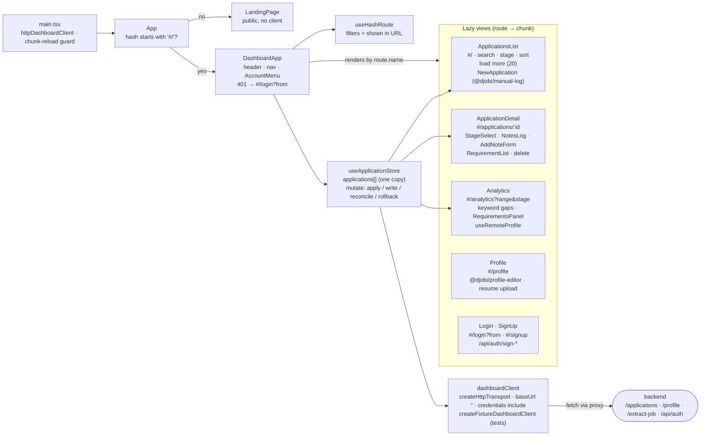

# `apps/dashboard`

A public web app for signing up, editing your Profile, and browsing and tracking past Applications.
Separate from the extension: it needs no `chrome.*` API, so it stays out of the MV3 bundle and gets
plain Vite HMR. Authenticated by Better Auth (email/password, Google) against the same backend the
extension uses — see `docs/multi-tenant-auth.md`.

```sh
pnpm dev:backend     # required — the dashboard has no data of its own
pnpm dev:dashboard
```

Port 5174, because 5173 is the extension dev server's `strictPort` and both usually run at once.
`vite.config.ts` proxies `/api`, `/applications`, `/profile` and `/extract-job` onto this dev server's own origin,
so the browser sees every backend call as same-origin — without it the session cookie is a
third-party cookie Chrome silently drops, which reads as "sign-in succeeded, then every request
401s."

## Dashboard internals

A hash-routed SPA. A URL with no `#/` hash is the public landing page, and `#/…` is the
authenticated app. Every view reads from one shared applications array held by
`useApplicationStore`. There is deliberately no `getApplication(id)`.



Stage changes are **slotted** mutations: they queue per `id:stage`, and only the newest reply is
applied. Note add and delete are **unslotted**: each tracks its own note by id. A failed write rolls
back only the fields it changed and shows `writeError`. A 401 from a load or write sets
`unauthorized`, and the shell sends the user to `#/login?from=…`.

## The one seam

`src/lib/dashboardClient.ts` holds the `DashboardClient` interface and both implementations, the
same way `backendClient.ts` does in the extension. Everything above it — views, components, tests —
is written against the interface, never against `fetch`.

`httpDashboardClient` is what the app runs on, against these backend routes:

| Call                        | Route                                                     |
| --------------------------- | --------------------------------------------------------- |
| `listApplications`          | `GET /applications`                                       |
| `extractJob`                | `POST /extract-job`                                       |
| `createApplication`         | `POST /applications`                                      |
| `findApplicationDuplicates` | `GET /applications?jobUrl=...&response=compact`           |
| `updateStage`               | `PATCH /applications/:id/stage?response=compact`          |
| `addNote`                   | `POST /applications/:id/notes?response=compact`           |
| `deleteNote`                | `DELETE /applications/:id/notes/:noteId?response=compact` |
| `deleteApplication`         | `DELETE /applications/:id`                                |
| `getProfile`/`saveProfile`  | `GET`/`POST /profile`                                     |
| `extractResume`             | `POST /profile/extract-resume`                            |
| `signIn`/`signUp`/`signOut` | Better Auth's `/api/auth/*`                               |

The write calls explicitly request compact acknowledgements because the store already has the full
Application and reconciles only the changed Stage or appended Note. Omitting the query parameter is
reserved for older clients that expect the full updated Application. `credentials: 'include'` is a
transport-level default on `httpDashboardClient`'s shared transport, so every call — not just the
auth ones — carries the session cookie.

`createFixtureDashboardClient` serves `src/lib/fixtures.ts` from memory and applies writes to its
own copy. It is **test-only** — `main.tsx` does not import it, and there is no runtime flag to
select it. A flag that swaps the backend for fake data is a flag that can be left on, and an app
that looks like it is saving while writing to memory is worse than one that visibly can't reach its
backend.

## Structure

| Path                                                   | What                                                                                                                                             |
| ------------------------------------------------------ | ------------------------------------------------------------------------------------------------------------------------------------------------ |
| `lib/dashboardClient.ts`                               | The interface, the HTTP adapter, the fixture adapter                                                                                             |
| `lib/useApplicationStore.ts`                           | One shared array of applications + optimistic writes                                                                                             |
| `lib/useHashRoute.ts`                                  | `list` (`#/`), `detail` (`#/applications/:id`), `analytics` (`#/analytics`), `login` (`#/login`), `signup` (`#/signup`), `profile` (`#/profile`) |
| `lib/stages.ts`                                        | Stage/category labels and order, taken from the schemas' `.options`                                                                              |
| `lib/analytics.ts`                                     | The Analytics view's aggregation over the loaded applications                                                                                    |
| `lib/dashboardSession.ts`                              | What a 401 means to a view, and the shared Profile fetch protocol                                                                                |
| `lib/format.ts`                                        | Display formatting for stored values (dates and the like)                                                                                        |
| `lib/requirementGroups.ts`                             | Groups posting requirements by importance band for `RequirementList` and `RequirementsPanel`                                                     |
| `lib/useRevealOnScroll.ts`                             | Batched, scroll-triggered reveal inside the Analytics requirements panel                                                                         |
| `lib/theme.tsx`                                        | Light/dark theme, guarded `localStorage`/`matchMedia` reads                                                                                      |
| `views/LandingPage.tsx`                                | The signed-out marketing page                                                                                                                    |
| `views/Login.tsx` / `SignUp.tsx`                       | Email/password (+ Google) sign-in and account creation                                                                                           |
| `views/ApplicationsList.tsx` / `ApplicationDetail.tsx` | Browse and edit one saved Application                                                                                                            |
| `views/NewApplication.tsx`                             | Dashboard counterpart to the extension's Log tab — extract a pasted posting and save a manual Application                                        |
| `views/Analytics.tsx`                                  | Stage/keyword-coverage/requirements reporting over saved Applications                                                                            |
| `views/Profile.tsx`                                    | The Profile editor, built from `@djobi/profile-editor` like the extension's options page, plus resume upload                                     |
| `components/`                                          | Stage controls, filter pills, notes log/composer, account menu, auth layout, requirement list/panel, posting link, `FakeSelect`                  |

Both views read from one array held above the router. A single-record fetch would give the list and
the detail page separate copies that can disagree after a write — see the comment in
`useApplicationStore.ts`.

## Tests

`pnpm --filter dashboard test`. `src/tests/*.test.tsx` (`navigation`, `applications-list`,
`application-detail`, `application-mutations`, `manual-application`, `analytics`, `auth`, `profile`)
drive the whole app through the fixture client with nothing mocked, split by page/functionality
rather than one monolithic `App.test.tsx`; `test-utils.tsx` is the shared render helper. The client
seam is the only substitution.
