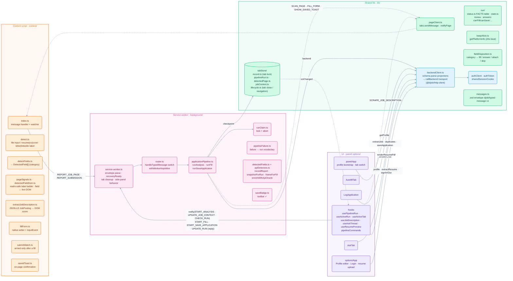
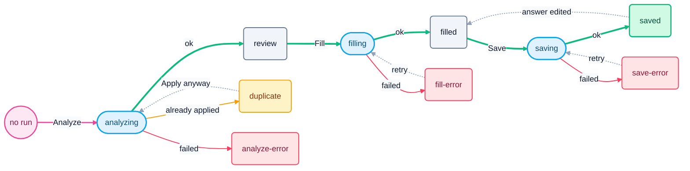

# `apps/extension`

MV3 · Vite + crxjs + React

## Chrome extension internals

There are four execution contexts, and each owns something specific. Content scripts own the DOM.
The service worker owns every step that costs money or can't be undone. The panel owns the
candidate's optimistic edits. `chrome.storage.session` is where they all meet.

Messages go one way on each channel. Panel and content script send typed messages _to_ the worker
(`lib/messages.ts`, validated against the envelope). Request/response commands go _to_ content
scripts through `lib/pageClient.ts`: from the worker (`SCAN_PAGE`, `FILL_FORM`, and the
fire-and-forget `SHOW_SAVED_TOAST`), and from the panel for `SCRAPE_JOB_DESCRIPTION`. Only
`UPDATE_RUN`, `START_FILL` and `START_SAVE_APPLICATION` reply to the panel, because a refusal writes
nothing to storage that the panel could observe. Every backend call, whether from the worker, the
panel or the options page, goes through `lib/backendClient.ts` — except sign-in and sign-out, which
`lib/authClient.ts` sends with a raw `fetch` because it needs Better Auth's `set-auth-token`
response header.

### Message protocol (`djobi/typed-message` v1)

| Message                   | From → To        | Reply                            | Effect                                                                               |
| ------------------------- | ---------------- | -------------------------------- | ------------------------------------------------------------------------------------ |
| `REPORT_JOB_PAGE`         | content → worker | ack                              | `recordReport` per (tab, frame); enrich via ATS oracle using the sending frame's URL |
| `START_ANALYSIS`          | panel → worker   | ack                              | clear badge; `runAnalysis` (duplicate guard → `/analyze`; `force` skips the guard)   |
| `START_FILL`              | panel → worker   | `ClaimResult`                    | `runFill` with `expectedRunId`                                                       |
| `START_SAVE_APPLICATION`  | panel → worker   | `ClaimResult`                    | `runSaveApplication` with `expectedRunId` (cancellation: none)                       |
| `UPDATE_RUN`              | panel → worker   | `{applied}`                      | `applyPanelEdit` under tab lock; saved → filled if changed                           |
| `UPDATE_JOB_CONTEXT`      | panel → worker   | ack                              | keep pasted JD across same-job routes                                                |
| `REPORT_SUBMISSION`       | content → worker | ack                              | auto Save Step for that `runId` (same claim; refuses a superseded run)               |
| `CHECK_RUN`               | panel → worker   | ack                              | no-op; wakes worker so recovery sweep runs (every 15s)                               |
| `SCAN_PAGE` / `FILL_FORM` | worker → content | `JobPageData` / `FillFormResult` | fresh scan; write values, attach resume bytes                                        |
| `SCRAPE_JOB_DESCRIPTION`  | panel → content  | `{candidate}` per frame          | best-scoring frame fills the editable JD field (fails closed)                        |
| `SHOW_SAVED_TOAST`        | worker → content | —                                | best-effort on-page toast                                                            |

## Application Pipeline — run state machine

Each tab has at most one **run**, stored in `chrome.storage.session`. The run goes through three
steps: **Analysis → Fill → Save**. Every step follows the same shape: a _running_ status, then a
_succeeded_ or _failed_ one (`STEP_STATUS` in `lib/run/status.ts`).

**How to read it:** thick arrows are the happy path. Blue pills mean a step is running, green is
done, amber means the run stopped on purpose, red means it failed. Dotted arrows go back.

Two things aren't drawn, to keep the diagram readable: **Analyze** can restart from _any_ status,
and **Fill** can also re-run from `filled`, `save-error` or `saved`. The table has the full rules.

| Step         | Starts from                                                 | Running     | Succeeded                 | Failed          |
| ------------ | ----------------------------------------------------------- | ----------- | ------------------------- | --------------- |
| **Analysis** | any status, or no run                                       | `analyzing` | `review` (or `duplicate`) | `analyze-error` |
| **Fill**     | `review` · `fill-error` · `filled` · `save-error` · `saved` | `filling`   | `filled`                  | `fill-error`    |
| **Save**     | `filled` · `save-error`                                     | `saving`    | `saved`                   | `save-error`    |

### Rules

- **One table decides.** The "Starts from" column is derived from `FACTS` in `lib/run/status.ts`.
  Fill needs a reviewable run that isn't busy. Save needs a fill that isn't busy and hasn't been
  recorded yet. The panel's buttons and the worker's claims both read `canStart`, so they can't
  disagree.
- **Analysis replaces, Fill and Save transition.** Analysis mints a new `runId` and supersedes
  whatever the tab held. Fill and Save go through `withRunClaim` with `expectedRunId`. If the run
  was replaced or is busy, they refuse with `{ claimed: false, reason: 'stale-run' | 'busy' }`.
- **`duplicate` is not an error.** The run stops before any LLM call because this job URL already
  has a saved Application.
- **Edits** (`UPDATE_RUN`) are accepted in every status except `saving`. An edit that changes a
  `saved` run moves it back to `filled`, because the saved record no longer matches.
- **Recovery.** When a new worker starts, it moves any run left in `analyzing`, `filling` or
  `saving` to that step's `*-error` status (failure kind `temporary`). It does this before routing
  any message.
- **Failure kinds.** `pipelineFailure.ts` maps every error to one of
  `cancelled · invalid-page · invalid-model-output · unauthorized · backend-unreachable · temporary · unknown`.
- **Fill outcome.** Based on what the page reports it kept, a finished fill sets `fillOutcome` to
  `complete · incomplete · nothing-filled · unverified · no-fields-detected`.

### Analysis Step (`runAnalysis`)

- Seeds a fresh run (`mode: replace`, `cancellation: supersede`).
- Runs in parallel: `snapshotForRun` (waits for the oracle to finish enriching) and `findDuplicate`
  (`GET /applications?jobUrl&response=compact`, skipped when `force`).
- Duplicate found → stop. No LLM call is made.
- Splits questions: `splitPreparedQuestions` answers what the Profile already covers. Only
  _required_ or known-answer questions go to the model.
- `backend.analyzeApplication(jd, profile, toDraft, signal)`
- Merges answers back into page order, then computes `keywordCoverage` locally.

### Fill Step (`fillStep`)

- Starts rendering the PDF _early_ if the analyzed form had a resume field.
- `frameForFill` → `SCAN_PAGE` on that frame; falls back to a broadcast scan (the fill itself is
  never retried).
- `mergeRescan`: takes elements from the fresh scan and wording from the analyzed run.
- Picks each value via `autofillSource(category)` (`lib/fieldDisposition.ts`): question / profile /
  resume / unsupported.
- Checks `claim.stillOurs()` immediately before the irreversible `FILL_FORM`.
- Computes `unresolvedRequiredFields` and `filledFieldCount` from the page's response.

### Save Step (`runSaveApplication`)

- Can't be cancelled on purpose: aborting mid-request can't tell you whether the row was written.
- Fetches the Profile fresh (best-effort) → `autofillApplicationPayload`.
- No `applicationId` yet → `POST /applications` with `idempotency-key: runId`. Otherwise →
  `PATCH /applications/:id`.
- Announces the save: toolbar badge plus on-page toast.

### MV3 survival kit

- `keepAlive`: calls `getPlatformInfo` every 20s while a step is pending. A pending fetch alone
  doesn't count as activity.
- Every step checkpoints to session storage, so a closed panel loses nothing.
- `recoverInterruptedPipelineRuns` must finish before the worker routes any message.
- `lifecycle.ts`: closing the tab clears its record. Navigating drops the detected frames, and keeps
  the run and Job Context only if the new URL is the same posting.
