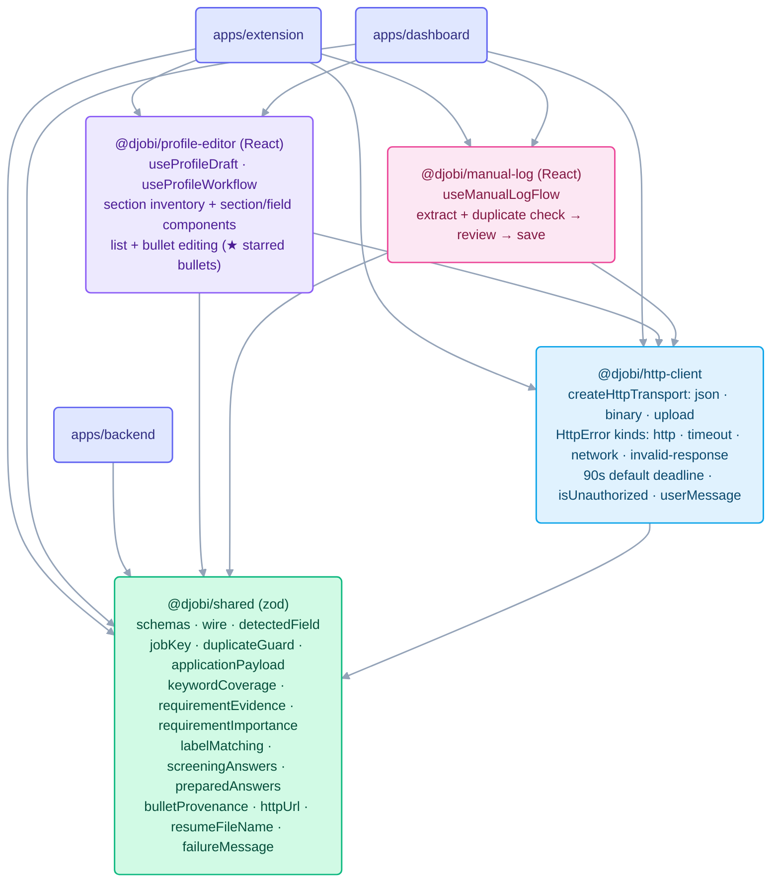

# `packages/`

Workspace packages shared by the three apps. Each package has its own `src/index.ts` as its public
surface; `@djobi/shared` has its own detailed README.

## Shared packages and who imports them

| Package                 | Imported by                                                                                                                                                                                                                                                                       |
| ----------------------- | --------------------------------------------------------------------------------------------------------------------------------------------------------------------------------------------------------------------------------------------------------------------------------- |
| `@djobi/http-client`    | extension `lib/callBackend.ts`, `lib/authClient.ts`, `options/Login.tsx`, `panel/useAskThread.ts`; dashboard `lib/dashboardClient.ts`, `lib/useApplicationStore.ts`, `lib/dashboardSession.ts`, `views/{Login,SignUp,Profile,NewApplication}.tsx`; `profile-editor`, `manual-log` |
| `@djobi/profile-editor` | extension `options/App.tsx`; dashboard `views/Profile.tsx`                                                                                                                                                                                                                        |
| `@djobi/manual-log`     | extension `panel/LogApplication.tsx`; dashboard `views/NewApplication.tsx`                                                                                                                                                                                                        |
| `@djobi/shared`         | all three apps, and the other three packages                                                                                                                                                                                                                                      |

`@djobi/shared` is the contract all three apps must agree on. `http-client` is client
infrastructure and is kept out of `shared` on purpose. `profile-editor` and `manual-log` hold
behavior shared by the two frontends: `profile-editor` also ships the section and field components
both Profile editors render, while `manual-log` is a hook only, and each app keeps its own form
markup and error policy.

### Where to start reading

- Domain terms: `CONTEXT.md`. Deploy direction: `docs/adr/0001-cloudflare-single-worker.md` and
  `docs/adr/0002-postgres-driver-for-local-dev.md`. Auth phases: `docs/multi-tenant-auth.md`.
- Backend wiring: `apps/backend/src/app.ts` → `routes/llm.ts` → `llm/structuredCall.ts`.
- Extension core: `background/applicationPipeline.ts`, `background/runClaim.ts`,
  `lib/run/status.ts`, `lib/messages.ts`.
- Page interaction: `content/detectFields.ts`, `content/fillForm.ts`,
  `background/apiDetectors.ts`.
- Dashboard state: `apps/dashboard/src/lib/useApplicationStore.ts`, `useHashRoute.ts`.
